# Requirements

- Java 21 SDK

# Usage

```bash
java ...
```

# Important

- In the `housings` folder you can find the instructions how to connect gates in specified circuit.

# Used circuits

## 74HC02

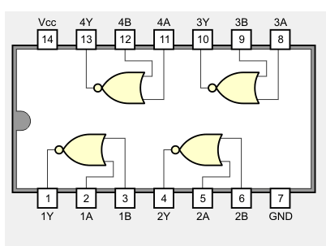

## 74HC04

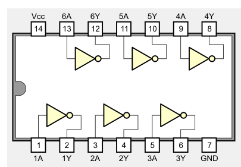

## 74HC08

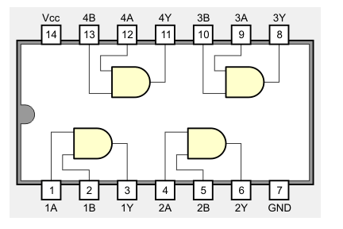

## 74HC10

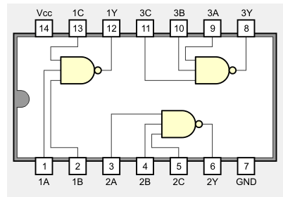

## 74HC11

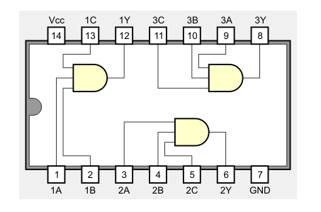

## 74HC20

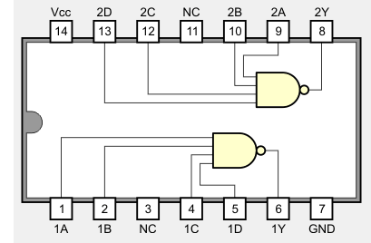

## 74LS00

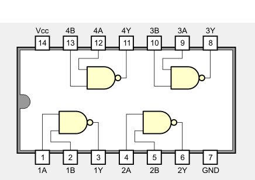

## 74LS31

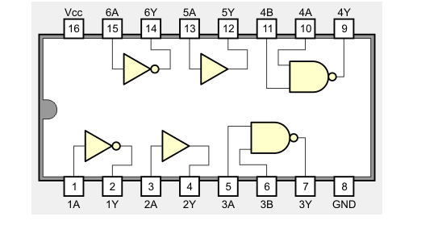

## 74LS32

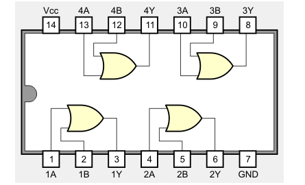

## 74ALS34

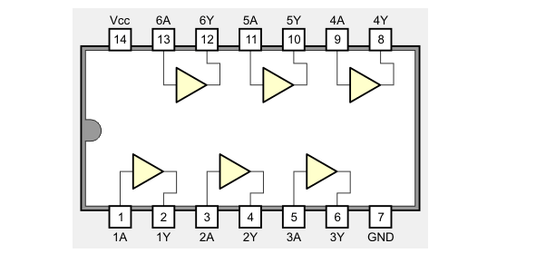

## 74LS42

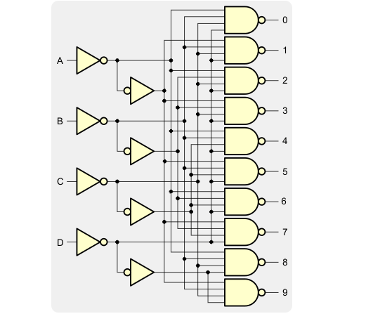

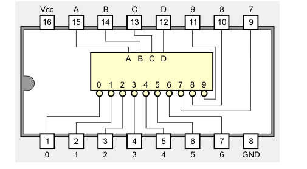

## 74LS44

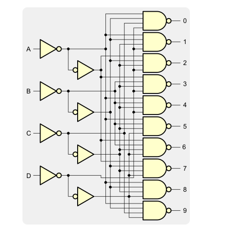

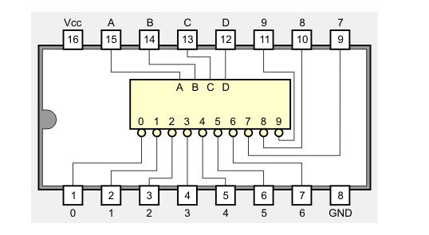

## 7482

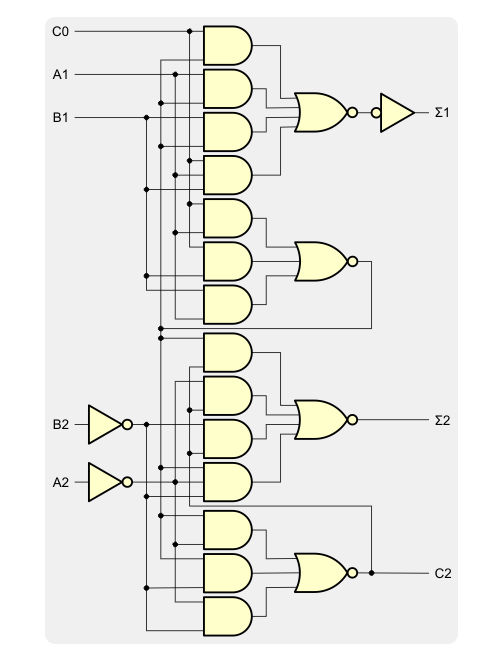

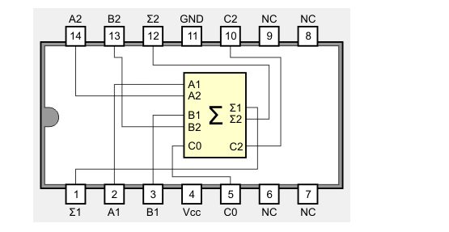

## 74138

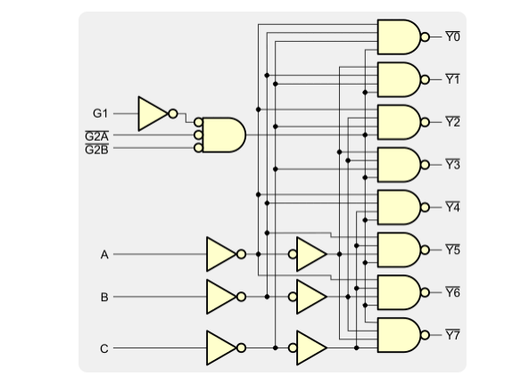

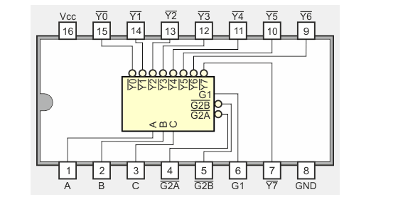

## 74152

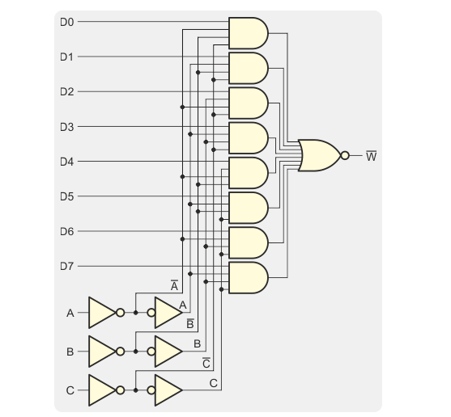

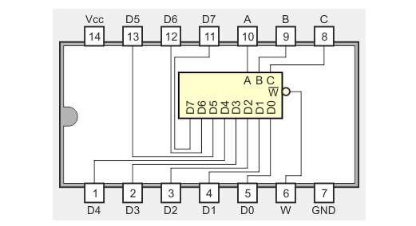
